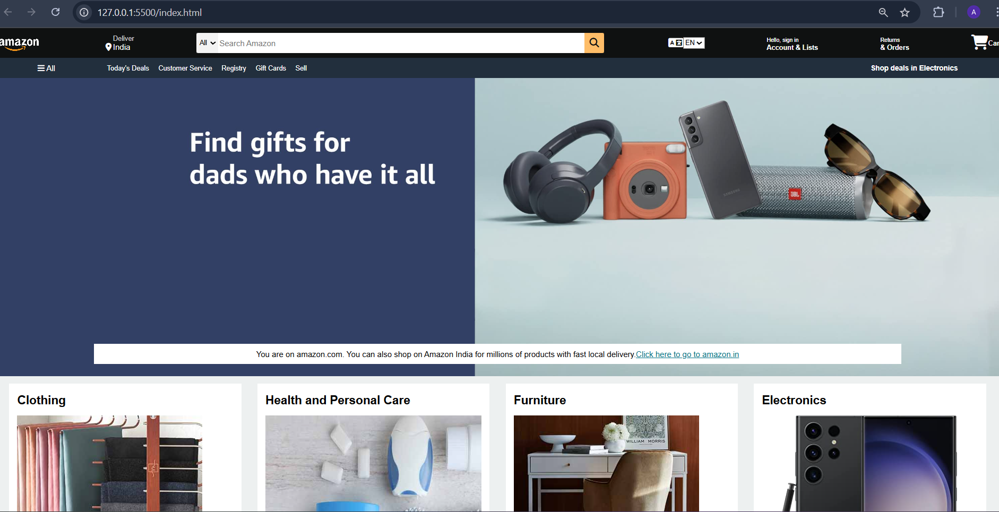

# Amazon Clone 🛒

A simple Amazon clone built using **HTML** and **CSS** to replicate the layout and structure of the popular e-commerce website.

## Features
- Home page with product categories
- Navigation bar with search functionality
- Product display grid
- Clean, responsive design

## How to Run
1. Clone the repository:
2. Open `index.html` in your browser.

## Preview

---

🛠️ Built for learning and practicing HTML & CSS. Feel free to contribute!

